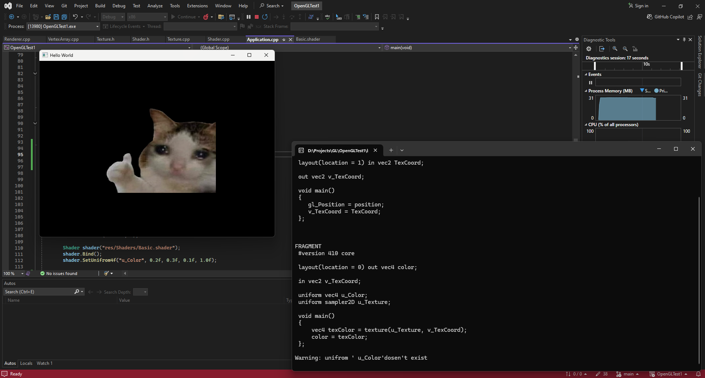
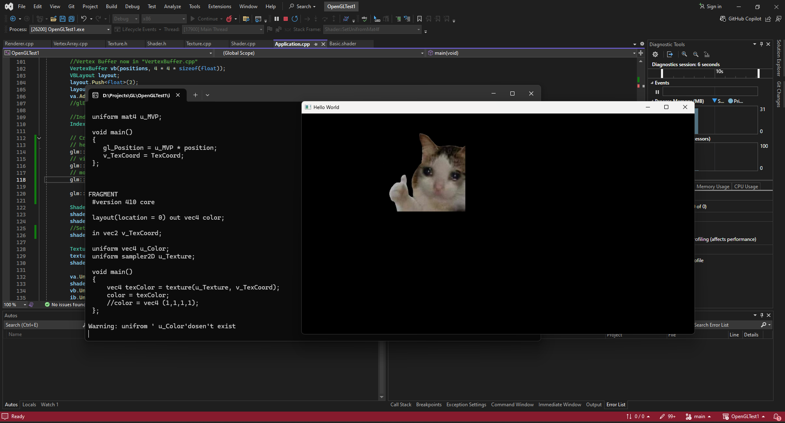

## Just a Demo Repo for me to play around and learn OpenGL

**So What’s This About?** 🤔

Think of this as a gym for graphics programming muscles. I’m here to:
- Flex my C++ + OpenGL skills(It aint great but will build soon). 💪
- Experiment, fail, and occasionally succeed in making cool visual stuff. 🎮
- This repo isn’t just code; it’s a journey through trials, errors, and aha moments.

**Why This Exists?**
To learn, to experiment, and to remind myself that debugging is just part of the process. Oh, and to slowly transition from "I understand OpenGL" to "I really know OpenGL."

This is mostly for my personal experiments, but if you’re here and feel like adding your own flair, feel free to:
- Open an issue.
- Submit a pull request.
- Or just laugh at my code in silence.

## Visual Updates :
Here is the progress stuff essentially , what all i am making as i go forward.  

**01/01/25  **
 
>Following [TheCherno](https://www.youtube.com/@TheCherno) on YT and created a blinking rectangle comprised of two triangles made using Index Buffers and drawn with the help of the Fragment and Vertex Shader.
Nothing Special but an amazing start to start drawing stuff.(this repo was created after some time of starting with the tutorials so everything is pretty classified in their respective files).

**07/01/25  **
 
>Going forward I started learning about textures and how are they drawn in OpenGL. Here we use the [stb_image.h](https://github.com/nothings/stb/blob/master/stb_image.h) to help out with reading the image file and then drawing it on the screen. We Created a Textures class which will be handling the texture drawing. the class contains simple bind and unbind functions with also the constructor function which handles reading and the texture data.
Apart from that we also updated our vertex and fragment shader to draw the texture on the rectangle we have. We pass the texture coordinates to the fragment shader and further assign the texture color in the fragment shader.

**29/01/25  **
 
>After a brief break (dont mention the gap , ik its been a while ;-;) continuing the road to OpenGL. Started of with understanding what projection matrices are and how they help while rendering on screen. Added GLM libray for mathematical operations in GL. Introduced an MVP matrix implementation where the vector coordinates are multiplied by the product of the Model, View, and Projection matrices to modify the position of the rendered object. The Model matrix contains the transformation values for the given object, the Projection matrix determines how the scene is projected (either orthographic or perspective), and the View matrix represents the camera’s transformation and how it affects the rendered scene

**30/01/25  **
 
>Included ImGUI to ease some debugging and to experiment with values on application runtime. Added Sliders to manipulate transform scale and rotation values for the rendered objects.

**01/02/25  **
 
>Added multiple test scenarios to make it easier for us to debug and experiemnt with snippets of examples. Made a base Test class which holds the function declarations which can further overrriden on the child classes.
Each child class acts as a test case. Used ImGUI to create a simple on startup menu from which you can select what test case you want to run. We create the all the required references and variables when the class is created and delete them when its destroyed.
Added a toggle in the shader code which switches between texture and color.
